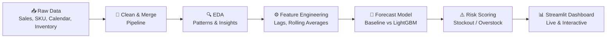

<div align="center">

# 📦 Project FORESIGHT
### AI-Powered Demand & Inventory Intelligence Platform


**A 4-week data science engagement simulating a real client project for NorthBay Living — a D2C home & lifestyle brand.**

[🚀 **View Live Dashboard**](https://project-foresight-9qzed7nexfyxcqgkjui7ay.streamlit.app) &nbsp;|&nbsp; [📊 Data](#-dataset) &nbsp;|&nbsp; [🧠 Methodology](#-methodology) &nbsp;|&nbsp; [📈 Results](#-key-results)

</div>

---

## 🎯 The Business Problem

> *"Every month we stock out of things people want and sit on things they don't. We're guessing how much to order and when."*
> — Head of Operations, NorthBay Living

NorthBay Living sells ~200 SKUs online across furniture, kitchen, lighting, decor, and storage categories — but plans inventory on gut feel and spreadsheets. This causes two costly problems **simultaneously**:

| 🔴 Problem | 💸 Business Cost |
|---|---|
| **Stockouts** | Best-sellers run out → lost sales, frustrated customers |
| **Overstock** | Slow movers pile up → cash locked in unsold inventory |

**Project FORESIGHT** turns raw sales and inventory data into a forecasting and early-warning system the operations team can act on — without needing a data scientist in the room.

---

## 📈 Key Results

<div align="center">

| Metric | Result |
|:---|:---:|
| 🎯 Baseline (Seasonal-Naive) Forecast Error | `31.21%` WAPE |
| 🚀 LightGBM ML Model Forecast Error | `24.93%` WAPE |
| ✅ Improvement Over Baseline | **20.1% better** |
| 💰 Inventory Value at Risk Identified | **₹9.57 Crore** |
| 🔴 SKUs Flagged for Urgent Reorder | `5` |
| 🟣 SKUs Flagged for Markdown/Clearance | `6` |

</div>

---

## 🏗️ How It Works



---

## 🖥️ Dashboard Preview

The live dashboard has **7 interactive sections**:

| Tab | What It Shows |
|---|---|
| 🟢 Overview | Company-wide KPIs, revenue trend, category revenue share |
| 🟡 Sales | Top/bottom performing products |
| 🩷 Category | Category-level revenue and unit breakdown |
| 🟠 Inventory | Stock levels, days of cover, at-risk SKUs |
| 🔴 Stock Risk | Reorder & overstock recommendations with rupee impact |
| 🟣 Promotion & Season | Promotion uplift, seasonal trends, holiday impact |
| 🔮 Forecast | Actual vs predicted demand, per-SKU drill-down |

👉 **[Try it live here](https://project-foresight-9qzed7nexfyxcqgkjui7ay.streamlit.app)**

---

## 🧠 Methodology

1. **Data Pipeline** — Ingests and cleans 4 raw extracts (deliberately imperfect, like a real client handoff) into one analysis-ready dataset.
2. **EDA** — Uncovered category trends, seasonality, and promotion impact through labelled charts.
3. **Feature Engineering** — Lag features (1/7/14/28 days) and rolling averages, computed **strictly from past data only** — zero leakage.
4. **Baseline Model** — Seasonal-naive forecast as the honest benchmark every model must beat.
5. **ML Model** — LightGBM, backtested on 8 weeks of held-out data, beating baseline by **20.1%**.
6. **Risk Scoring** — Combines forecast + inventory position into 4 action categories: *Reorder Now, Markdown/Clear, Watch/Volatile, Healthy*.
7. **Dashboard** — Ships insights as a live, filterable, non-technical-friendly web app — not just a notebook.

---

## 🔍 Key Business Insights

1. 🏠 **Home Decor** drives the most revenue; **Lighting** is the weakest category.
2. ❄️ **Winter** is the peak season; **Autumn** is the weakest.
3. 🎯 Promotions lift average daily sales by **~38%**.
4. 🚨 **5 SKUs** are within days of stocking out (as low as 2 days of cover).
5. 📦 **6 SKUs** are overstocked — capital that could be freed via markdown.

---

## 📊 Dataset

Four simulated extracts, deliberately imperfect to mirror a real client handoff:

| File | Description |
|---|---|
| `sales_daily.csv` | Daily units sold, revenue, price, promotion flag per SKU |
| `sku_master.csv` | Category, cost price, selling price, launch date per SKU |
| `calendar.csv` | Week, season, holidays, promotion events per date |
| `inventory_snapshots.csv` | On-hand stock, lead time, reorder point per SKU |

**🔎 Data-quality finding:** `inventory_snapshots.csv` contains 200 SKUs, but only 50 have matching sales/product history — handled by flagging (not dropping) inventory-only SKUs. 36,150 missing calendar entries were also cleaned.

---

## 🛠️ Tech Stack

`Python` · `pandas` · `numpy` · `scikit-learn` · `LightGBM` · `Streamlit` · `Matplotlib`

**Deployment:** Streamlit Community Cloud &nbsp;|&nbsp; **Version Control:** Git & GitHub

---

## 📁 Project Structure

---

## ⚙️ Setup & Run

```bash
# 1. Create and activate a virtual environment
python -m venv venv
venv\Scripts\activate        # Windows
source venv/bin/activate     # Mac/Linux

# 2. Install dependencies
pip install -r requirements.txt

# 3. Run the pipeline end-to-end
python src/pipeline.py
python src/features.py
python src/baseline.py
python src/forecast_model.py
python src/risk_scoring.py

# 4. Launch the dashboard
streamlit run app/dashboard.py
```

---

## ✅ Project Roadmap

- [x] Project setup & environment
- [x] Data profiling & cleaning pipeline
- [x] Exploratory Data Analysis with labelled charts
- [x] Feature engineering (leakage-free)
- [x] Baseline + ML forecasting model (backtested)
- [x] Stockout/overstock risk scoring
- [x] Interactive Streamlit dashboard
- [x] Live deployment on Streamlit Community Cloud
- [ ] Executive readout & final submission

---

<div align="center">

**Built as part of the Zidio Development Data Science & Analytics Internship**

*Deliver it like a consultant. Defend it like a scientist.*

</div>